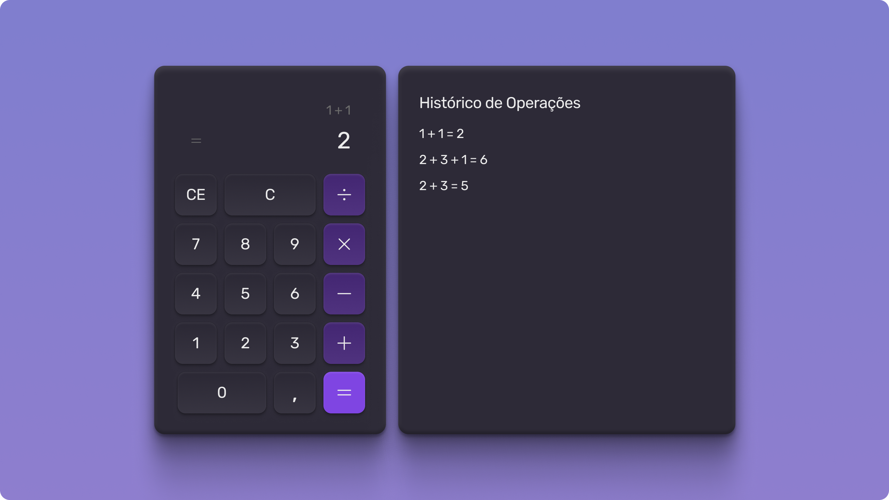

# Calculadora simples

> Este é um projeto de uma calculadora simples com as operações básicas de matemática, desenvolvido com o objetivo de praticar conceitos de front-end. O projeto foi construído usando HTML, CSS, JavaScript e implementação de framework React.JS.

## 🚀 Tecnologias

Esse projeto foi desenvolvido com as seguintes tecnologias:

- HTML e CSS
- JavaScript
- Git e Github
- Figma
- React.JS 

## :memo: Licença

Esse projeto está sob a licença MIT.

---

Feito com ♥ by Rocketseat :wave: [Participe da nossa comunidade!](https://discord.gg/rocketseat)